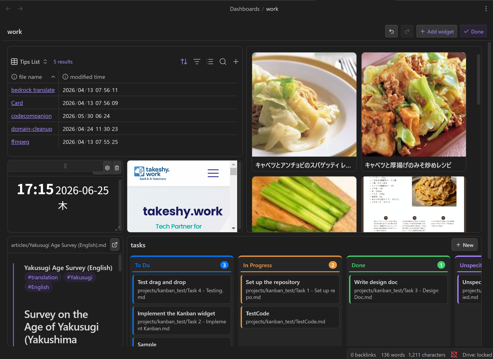
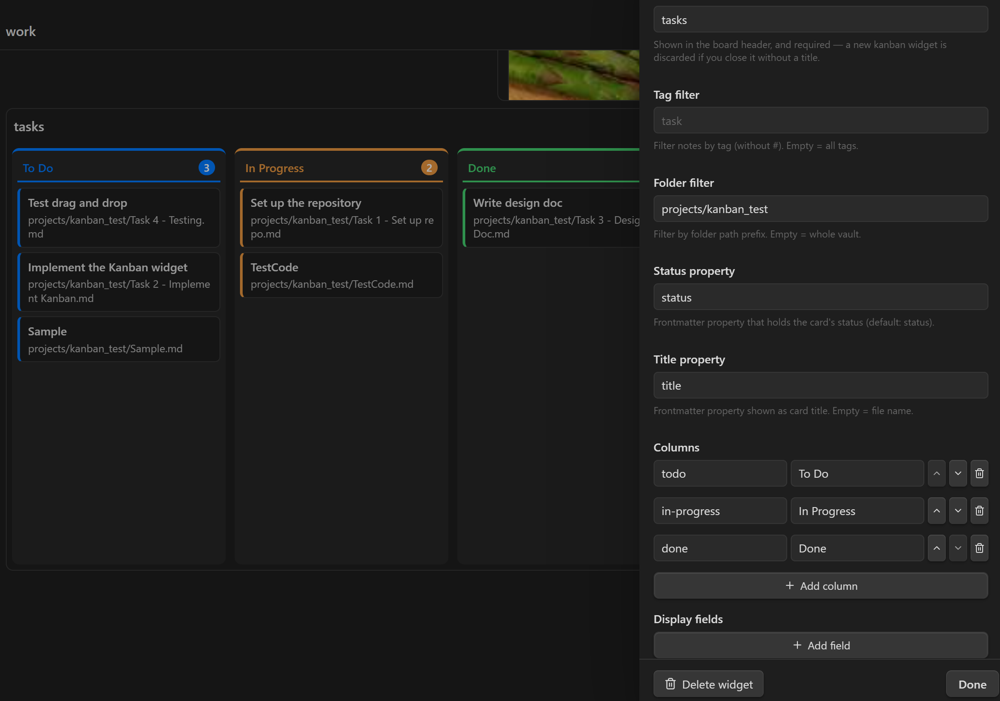

# Dashboard

個人用の **ホーム / 概要ページ** を、レスポンシブなウィジェットグリッドで作成できます。Dashboard は `.dashboard` ファイルとして保存され、**Bases ビュー**、**ノート**、**Web ページ**、**ワークフロー出力**をドラッグ・リサイズ可能なグリッドに配置します。通常のノートと同じように開くと、ライブで編集できるボードとして表示されます。



- [Dashboard と Canvas の違い](#dashboard-と-canvas-の違い)
- [Dashboard を作成する](#dashboard-を作成する)
- [編集モード](#編集モード)
- [ウィジェットの種類](#ウィジェットの種類)
  - [Base](#base--bases-ビューを埋め込む)
  - [Markdown](#markdown--ノートを埋め込む)
  - [Web Embed](#web-embed--web-ページを埋め込む)
  - [Workflow](#workflow--ワークフロー出力を表示する)
  - [Kanban](#kanban--カードをドラッグしてステータスを変更する)
- [レスポンシブレイアウト](#レスポンシブレイアウト)
- [AI でウィジェットを作成する](#ai-でウィジェットを作成する)
- [`.dashboard` ファイル形式](#dashboard-ファイル形式)
- [Tips & Notes](#tips--notes)

---

## Dashboard と Canvas の違い

Obsidian の **Canvas** と Dashboard は見た目が似ていますが、目的が異なります。

| | Dashboard | Canvas |
|---|-----------|--------|
| **コンテンツ** | **ライブ**。Bases ビュー、ワークフロー出力、ノートが自動的に更新される | **静的**。カードは手作業で配置したスナップショット |
| **レイアウト** | レスポンシブグリッド（12 列。狭い画面では 1 列にリフロー） | 絶対座標の自由配置、無限キャンバス |
| **用途** | タスク、生成ダイジェスト、埋め込みページなどを確認する **ホーム / 概要** ページ | アイデアを並べ、矢印でつなぐ **思考** のための空間 |
| **AI** | チャットから作成可能（`dashboard` skill が `.dashboard` と backing `.base` を作成） | 基本は手動配置 |
| **閲覧** | 誤操作しにくい読み取り用の表示モードがある | 常に編集可能 |

要するに、**Dashboard** はライブな一覧・ダイジェスト・埋め込みを一覧するためのページです。**Canvas** はアイデアや関係性を自由に配置して考えるための空間です。主な違いは **動的 vs 静的**、**レスポンシブグリッド vs 自由配置** です。

---

## Dashboard を作成する

Dashboard の作成方法は 2 つあります。

1. **コマンド** — コマンドパレットから **"LLM Hub: Create dashboard"** を実行します。`Dashboards/` フォルダに `Dashboard`、`Dashboard 2`、... という名前で新しいファイルを作成して開きます。
2. **AI に依頼** — このプラグインには組み込みの **`dashboard`** agent skill があります。チャットで有効にして、作りたい内容を説明します（例: "active tasks、welcome note、today's weather を含む home page"）。AI が `.dashboard` ファイルと、必要な backing `.base` ファイルを作成します。

Dashboard は Vault 内の通常の `.dashboard` ファイルとして保存されるため、他のノートと同じように同期・バージョン管理できます。

---

## 編集モード

Dashboard は最初 **表示モード** で開きます。ツールバーで切り替えます。

- **Edit** — 編集モードに入ります。ウィジェットをドラッグして移動し、右下ハンドルでリサイズし、**歯車**で設定を開き、**ゴミ箱**で削除できます。
- **+ Add widget** — ウィジェットパレットを開きます（編集モードのみ）。
- **Undo / Redo** — このセッション中のレイアウト変更を戻す / やり直します。
- **Done** — 表示モードに戻ります。

> すべての編集は **自動保存** されます。別途保存ボタンはありません。

---

## ウィジェットの種類

編集モードで **+ Add widget** をクリックすると、ウィジェットの種類を選べます。

### Base — Bases ビューを埋め込む

`.base` ファイルの指定したビューを、Obsidian の **ネイティブ Bases UI**（table / cards / list / map）で表示します。これは主要なデータ表示ウィジェットです。ノートの一覧・表・カード表示を自前で再実装するのではなく、`.base` を作成して Base ウィジェットから参照してください。

| 設定 | 説明 |
|------|------|
| **Base file** | `.base` ファイルの Vault パス |
| **View** | 表示するビュー名。空の場合は base の最初のビュー |
| **Create with AI** | パネルを離れずに新しい `.base` を作成、または選択中の `.base` を編集 |

同じ `.base` ファイルを複数の Base ウィジェットから参照できます。たとえば 1 つの `.base` に Active / Done / Backlog などのビューを作り、それぞれ別ウィジェットで表示できます。

### Markdown — ノートを埋め込む

既存の Markdown ノートを読み取り専用の埋め込みとして表示します。ヘッダーのアイコンから元ノートを開けます。

| 設定 | 説明 |
|------|------|
| **Markdown note** | 埋め込むノートの Vault パス（検索可能な picker） |

### Web Embed — Web ページを埋め込む

Web ページを iframe で埋め込みます。

| 設定 | 説明 |
|------|------|
| **URL** | 埋め込むページの URL |

> [!NOTE]
> 一部のサイトは `X-Frame-Options` / `Content-Security-Policy` ヘッダーで埋め込みをブロックします。その場合は空白表示になることがあります。

### Workflow — ワークフロー出力を表示する

既存の [workflow](WORKFLOW_NODES.md) を **headless** に実行し、その出力を Markdown または HTML として表示します。ダイジェスト、要約、レポートなど、動的に生成される内容を Dashboard に置けます。

| 設定 | 説明 |
|------|------|
| **Output format** | `Markdown` または `HTML`。HTML は sandbox 付き iframe で表示 |
| **Workflow** | 実行する workflow ノート |
| **Create with AI** | このウィジェット用の workflow を新規作成、または選択中の workflow を編集 |
| **Output variable** | 出力文字列を保持する workflow 変数（既定: `result`） |
| **Run** | workflow を今すぐ実行し、結果を cache |
| **Auto-refresh interval (minutes)** | `0` = 手動のみ。それ以外は、開いたときに cache がこの分数より古ければ一度実行し、Dashboard を開いている間は同じ間隔で定期実行 |

> [!IMPORTANT]
> **Workflow ウィジェットは live 実行ではなく cache を表示します。** 重い workflow が Dashboard を開くたびに実行されないよう、描画パスは **sidecar cache だけ** を読みます。実行されるのは次の場合だけです。
>
> - ウィジェットヘッダーまたは設定パネルで **Run** をクリックしたとき
> - Dashboard を開いたときに cache が auto-refresh interval より古いとき
> - Dashboard を開いたまま auto-refresh interval が経過したとき
>
> 結果は Dashboard の隣にある hidden **sidecar file** に保存されます。そのため `.dashboard` ファイルを肥大化させず、再オープン後も出力が残ります。Workflow は Markdown/HTML の出力を文字列変数（既定: `result`）に保存する必要があります。card/table 出力は対応していません。無人実行されるため、interactive node（`prompt-*`, `dialog`）は使わないでください。

### Kanban — カードをドラッグしてステータスを変更する

**タグ**または**フォルダ**条件に一致するノートをカードとして表示し、frontmatter の **status property** ごとに列へグループ化します。カードを別の列へドラッグすると、そのノートのステータスが `processFrontMatter` で更新されます。カードをクリックするとノートのプレビュー modal が開き、open アイコンから新しいタブで元ノートを開けます。Kanban は **表示モード** でも操作できます。編集モードに入る必要はありません。


ボードヘッダーには任意の **title** と **New** ボタンが表示されます。New を押すと、カードタイトルと列を選ぶ小さな modal が開きます。作成されるノートは、このボードの filter に一致するように、設定された folder に作成され、tag が付き、選択した列の status が設定されます。作成後も Dashboard に留まり、新しいカードがボード上に表示されます。ノートを開きたいときはカードをクリックします。

編集モードのウィジェット設定でボードを構成できます。



| 設定 | 説明 |
|------|------|
| **Board title** | ボードヘッダーに表示されます。複数のボードを置く場合に便利です。 |
| **Tag filter** | このタグを持つノートだけ表示します（`#` なし）。空 = すべてのタグ |
| **Folder filter** | このパス prefix に一致するノートだけ表示します。空 = Vault 全体 |
| **Status property** | カードのステータスを保持する frontmatter property（既定: `status`） |
| **Title property** | カードタイトルとして表示する frontmatter property。空 = ファイル名 |
| **Columns** | ステータス値の順序付きリスト。各列には property と照合する **value** と、ヘッダー表示用の **label** があります。 |
| **Display fields** | 各カードのタイトル下に表示する frontmatter property 名の順序付きリスト（例: `priority`, `due`）。`name: value` として表示され、空値は省略、list 値は comma join されます。 |
| **Show unmatched cards column** | ON の場合、どの列にも一致しないカードを追加の "Unspecified" 列に表示します（既定 ON）。 |

未知のウィジェットタイプ（新しい plugin version で追加されたものなど）は **保存時に保持** され、placeholder として表示されます。未対応の Dashboard を編集してもデータは落ちません。

---

## レスポンシブレイアウト

グリッドはコンテナ幅に応じて 2 つの breakpoint を切り替えます。

| Breakpoint | 条件 | レイアウト |
|------------|------|------------|
| **`lg`**（wide） | 768px 以上 | 編集モードで配置したレイアウト（既定 12 列） |
| **`sm`**（narrow） | 768px 未満 | ウィジェットを **1 列の全幅** にして上から順に積む |

既定では、`sm` レイアウトは wide レイアウトから自動生成されます（縦位置順）。狭い画面でウィジェットを動かした場合、その明示的な `sm` 位置は保持され、残りのウィジェットがその周囲を埋めます。

---

## AI でウィジェットを作成する

**Base** と **Workflow** ウィジェットの設定パネルには **Create with AI** ボタンがあります。

- **Base** ウィジェットでは、`.base` ファイルを作成する AI authoring dialog が開きます。AI は read-only tool（read, search, list）でノートを調べ、必要な frontmatter property を発見できます。たとえば cover image 付き card view を依頼しても、property 名を手で指定する必要はありません。すでに base が選択されている場合、ボタンは **Edit with AI** になり、現在の `.base` との差分を表示します。追加指示を入れて再生成し、**Apply** で反映できます。
- **Workflow** ウィジェットでは、そのウィジェットに合わせた workflow を生成または編集します。AI には出力変数へ単一の Markdown/HTML 文字列を入れること、interactive node を避けることが指示されます。生成後、ウィジェットは自動的に実行されて表示が更新されます。

チャットから組み込みの **`dashboard`** agent skill を使って、Dashboard 全体を作成することもできます。この skill は `.dashboard` schema と Bases authoring reference を把握しています。

---

## `.dashboard` ファイル形式

`.dashboard` ファイルは YAML です。通常は手で編集する必要はありません（visual editor と AI が管理します）が、round-trip safety のため schema を記載します。

```yaml
version: 1
grid:
  cols: 12        # column count (default 12)
  rowHeight: 80   # pixels per grid row
  gap: 8          # pixels between cells
widgets:
  - id: <uuid>                            # unique id (UUID-like string)
    type: base | markdown | web | workflow | kanban
    layout:
      lg: { x: 0, y: 0, w: 6, h: 4 }      # required: position on the wide grid
      sm: { x: 0, y: 0, w: 12, h: 4 }     # optional: auto-derived (stacked) if omitted
    config: { ... }                       # per-widget-type config (see below)
```

- **`layout.lg`** は wide（768px 以上）での位置です。`x`/`y` は左上 cell（0-based）、`w`/`h` は cell 単位の幅と高さです。
- **`layout.sm`** は狭い画面での位置です。省略すると、全幅 1 列として自動的に積まれます。
- ウィジェットが重ならないように配置してください。縦に積む場合は `y` を増やします。

### ウィジェット別 `config`

```yaml
# base
config:
  base: Dashboards/Bases/Tasks.base   # vault path to the .base file
  view: Active                        # view name; omit/empty = first view

# markdown
config:
  path: Home.md                       # vault path to a markdown note

# web
config:
  url: https://example.com

# workflow
config:
  workflow: workflows/Daily Digest.md # vault path to the workflow note
  output: markdown                    # markdown | html
  outputVariable: result              # variable holding the output string
  refreshInterval: 60                 # minutes; 0/omit = manual refresh only

# kanban
config:
  tag: task                           # optional tag filter (without #)
  folder: ""                          # optional folder path prefix
  statusProperty: status              # frontmatter property holding the status
  titleProperty: ""                   # frontmatter property for card title (empty = file name)
  displayFields: [priority, due]      # frontmatter properties shown on each card
  columns:                            # ordered list of status values
    - value: todo
      label: To Do
    - value: in-progress
      label: In Progress
    - value: done
      label: Done
  showUnspecified: true               # show cards with no/unknown status
```

### 完全な例

```yaml
version: 1
grid:
  cols: 12
  rowHeight: 80
  gap: 8
widgets:
  - id: tasks-active
    type: base
    layout: { lg: { x: 0, y: 0, w: 8, h: 6 } }
    config:
      base: Dashboards/Bases/Tasks.base
      view: Active
  - id: readme
    type: markdown
    layout: { lg: { x: 8, y: 0, w: 4, h: 6 } }
    config:
      path: Home.md
  - id: docs
    type: web
    layout: { lg: { x: 0, y: 6, w: 12, h: 4 } }
    config:
      url: https://help.obsidian.md
```

---

## Tips & Notes

- **先にデータを作る。** Base ウィジェットでは、参照する前に `.base` ファイルとビューを作成します。AI dashboard skill はこれを一括で行います。
- **ビューで分ける。** Active / Done / Backlog などを表示する場合、`.base` を複製せず、1 つの `.base` に複数ビューを作って複数の Base ウィジェットから参照します。
- **Workflow ウィジェットは軽く保つ。** 結果は cache されます。毎回実行するのではなく、適切な **Auto-refresh interval** を設定し、出力は `result` に保存してください。
- **Desktop only.** Dashboard はこの plugin の他機能と同じく Obsidian desktop で動作します。
- **ファイルは Vault に保存される。** Dashboard は `Dashboards/` 配下の `.dashboard` ファイルとして保存され、他のノートと同じように同期・バージョン管理できます。Workflow cache は各 Dashboard の隣に hidden sidecar file として保存されます。

> 関連: [Workflow Nodes](WORKFLOW_NODES.md) · [Agent Skills](SKILLS.md)
