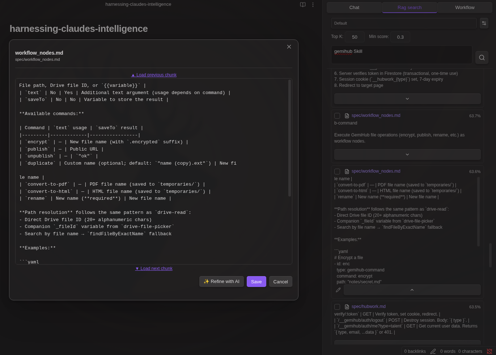
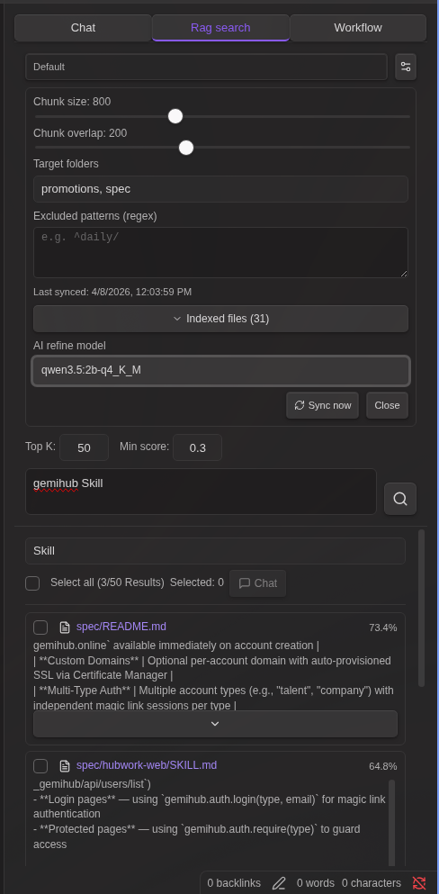

# RAG Search

The **RAG Search** tab provides a dedicated interface for semantic vector search, keyword filtering, chunk editing, and sending results to Chat.

## Search

1. Select a **RAG setting** from the dropdown (each setting has its own index, embedding model, and parameters)
2. Enter a query and press Enter or click the search button
3. Adjust **Top K** (max results) and **Score Threshold** (minimum similarity) as needed

Results are ranked by cosine similarity between the query embedding and each indexed chunk.

Both **Markdown** and **PDF** files in the vault are indexed. PDF text is automatically extracted using Obsidian's built-in PDF.js and chunked the same way as Markdown content. PDFs with no extractable text (e.g. scanned/image-only) are skipped.

## PDF Result Handling

PDF search results are displayed with a **PDF** badge and page range (e.g. `PDF (pages 2-5 of 24)`) in the result header. The page range is computed from the chunk's position in the extracted text.

- **As text** — The extracted text is shown in the result preview, supports keyword filtering, and can be edited in the chunk editor
- **As PDF** — Click the file path to open the original PDF in Obsidian

If PDF text extraction fails temporarily (e.g. encrypted PDF, read error), existing indexed chunks are preserved on the next sync rather than being silently removed.

## Keyword Filter

After a semantic search, use the keyword filter at the top of the results list to narrow down results. Multiple filter fields can be combined for precise filtering.

- **Within a field** — Space-separated terms use **OR** logic (any term matches)
- **Between fields** — Multiple fields use **AND** logic (all fields must match)
- Click the **+ AND** button to add another filter field
- Click **✕** to remove a filter field
- Matches against both chunk text and file path
- Whitespace in text is normalized (newlines, fullwidth spaces collapsed) so PDF extraction artifacts don't break matching
- Also matches against a space-stripped version of the text, so CJK words split by PDF extraction spaces still match (e.g. searching "3つのコア機能" matches "3 つのコア機能")
- The "Select all" checkbox and count reflect the filtered view
- Clear all filters to see all results again

### AI Keyword Suggestion

Each filter field has an **✦** (sparkle) button that uses AI to expand your keywords with synonyms and related terms.

- Enter one or more keywords, then click ✦
- The configured **AI Refine Model** generates related terms and replaces the field content
- If the input is not in English, English translations and related English terms are also included
- Redundant terms that contain an original keyword as a substring are automatically removed (they would not improve OR filtering)
- Click the **↩** (undo) button to restore the original keywords
- Requires a model to be selected in **AI Refine Model** (search settings gear icon)

This is useful for catching variations in terminology that embedding similarity may have missed, while still filtering within the already-retrieved results.

## Selecting Results

- Click a result row to toggle its selection
- Use the **Select all** checkbox to select/deselect all visible (filtered) results
- The **Selected** count shows how many results are selected across all results (not just the filtered view)

## Sending Results to Chat

Select results with checkboxes, then click **Chat**. Results are added as attachments in the Chat input area.

## Editing Chunks

Click the pencil icon (visible when a text result is expanded) to open the chunk editor modal.

In the editor you can:

- **Edit the text** — Modify the chunk content freely. Changes are saved back to the search results list.
- **Load previous chunk** — Click `▲ Load previous chunk` to prepend the preceding chunk from the same file. Overlap between chunks is automatically removed.
- **Load next chunk** — Click `▼ Load next chunk` to append the following chunk from the same file. Overlap is removed.
- **Combine and edit** — After loading adjacent chunks, the full text is editable as one block. Save to update the result.

This is useful when a semantic search returns a chunk that is missing important context from the surrounding text.

Edited results show an **"Edited"** badge and a left accent border in the results list. AI-refined chunks open as a text-only editor on reopen (without prev/next/refine controls), while manually edited chunks retain the full editing interface.

## Refine with AI

Click **Refine with AI** in the chunk editor to automatically expand and clean up the text using your local LLM.

**How it works:**

1. **Initial expansion** — Loads up to 3 previous and 3 next chunks in parallel
2. **AI evaluation** — The LLM evaluates whether the text has enough context for the search query. If more is needed, it loads 3 more chunks in the indicated direction (up to 5 iterations)
3. **Refinement** — The LLM cleans up the combined text: removes chunking artifacts, broken sentences, and noise while preserving all meaningful information. The result streams into the editor.

**Setup:** Select a model in the **AI Refine Model** dropdown in the search settings (gear icon). The dropdown lists models available on your local LLM server. The button is disabled when no model is selected.

**Notes:**
- The button is hidden after use (one-time operation per edit session)
- Previous/next chunk links are hidden during and after refinement
- The textarea is disabled during processing to indicate activity
- The original language of the content is preserved

## Index Settings

Click the gear icon in the search bar to open inline index configuration:

- **Chunk Size** — Characters per chunk
- **Chunk Overlap** — Character overlap between adjacent chunks
- **Target Folders** — Limit indexing to specific folders (comma-separated)
- **Exclude Patterns** — Regex patterns to exclude files (one per line)
- **AI Refine Model** — Select the LLM model used for "Refine with AI" in the chunk editor (none = disabled)
- **Sync** button with last-sync timestamp
- **Indexed files** list with per-file chunk counts

## How RAG Works in Chat vs Search

| | Chat + RAG dropdown | Search -> Select -> Chat |
|---|---|---|
| **Context injection** | System prompt (automatic) | User message attachments |
| **Parameters** | Uses RAG setting defaults | Adjustable per search (Top K, threshold) |
| **Result selection** | All results included automatically | User selects which results to include |
| **Adjacent chunks** | Not available | Load prev/next chunks in editor |
| **Keyword filter** | Not available | Filter results before selecting |
| **AI refinement** | Not available | Auto-expand chunks and refine with LLM |

The Search flow gives more control over what context is sent to the LLM. The Chat RAG dropdown is a convenient shortcut for fully automatic context injection.
